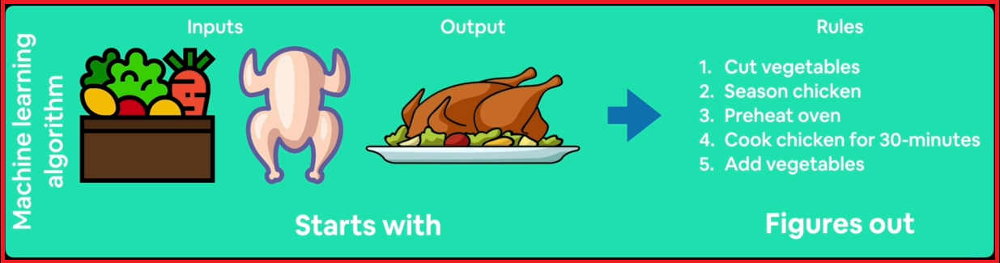

# Introduction To Deep Learning 

### What is Deep Learning?

-  Deep Learning is a type of machine learning based on artificial neural networks in which multiple layers of processing are used to extract progressively higher level features from data.

### What is MAchine Learning?

- Machine learning is turning things (data) into numbers and finding patterns in those numbers.


### What is the difference between Traditional Programming and Machine Learning (or) Deep Learning Algorithms?

- With Traditional programming, you might start with some inputs. You might code up a bunch of rules. In this case, a chef wants to cook chicken dish, he have the recipe.


- Chef has to follows certain rules to get the output.

- Whereas, In Machine Learning (or) Deep Learning Algorithms usually differ is that you'll start with inputs and the ideal output.



Algorithm will figure out the ideal rules to get the output like ideal output.


# Why Use Deep Learning

### Why we have to use machine Learning (or deep learning)?

- **Better reason:** For a complex problem, such as like teaching self driving car how to drive so, can you think of all the rules? as per traditional programming? Probably Not

If you can build a **simple rule-based** system that doesn't required machine learning, do that

## What Deep Learning is good for:

- **Problems with long lists of rules :** when the traditional approach fails, machine learning/deep learning may help.

- **Coutinually changing environments :** deep learning can adapt ('learn') to new scenarios.

- **Discovering insights within large collections of data :** can you imagine trying to hand-craft rules for what 101 different kinds of food look like?
You imagine trying to handcraft the rules for one one hundred and one different kinds of food look like

## What Deep Learning is not good for:

- **When you need explainability :** the patterns learned by a deep learning model are typically uninterpreted by a human.

- **When the traditional approach is a better option :** if you can accomplish what you need with a simple ruled-based system.

- **When errors are unacceptable :** since the outputs of deep learning model aren't always predictable.

- **When you don't have much data :** deep learning models usually require a fairly large amount of data to produce great results.


# Introduction to Neural Network

## What is neural network?

- A **neural network** is a network (or) circuit of neurons, (or) in a modern sense, an artificial neural networks (ANNs), composed of artificial neurons (or) nodes.


1. Suppose we have various inputs such as images of food, nlp text, and sound wave(audio data) what's going into the microphone. 
    
2. Then we have to turn these input data into numbers - numerical encoding

3. Feed the numerical data into the neural network (select appropriate neural network) - Learning representations (patterns/features/weights).

4. Then it creates some representation outputs - in numerical representation

5. Finally, the neural network outputs convert these numerical representations into human readable representation.

# Anatomy of Neural Networks


### Input Layer

- Here, we can see we neural network have two nodes (or) neurons in it's first layer that is the **Input Layer**

    **Input layer** (#units/neurons = 2) 

- **Input layer** is used to pass the data to the Hidden layer(s) (or) to the neural network.


### Hidden Layer(s)

- Here, we can see **Hidden layer** have three nodes (or) neurons It is the middle part of the neural network

    **Hidden Layer(s)** (#units/neurons = 3)

- **Hidden layer** can be more than one (or) multiple as per network requirements.

- **Hidden layer(s)** is used to learn patterns in data.

### Output Layer

- **Output layer** learned representation (or) prediction probabilities

# What is TensorFlow

- End-to-end platform for machine learning

- Write fast deep learning code in python/er accessible languages (able to run on a GPU/TPU)

- Able to access many pre-built deep learning models (TensorFlow Hub)

- Whole stack: preprocess data, model data, deploy model in your application.

- Originally designed and used in-house by Google (now open-source)

## What is a tensor?


- Tensor is a numerical way to represent the information.

- If we want to encode these images, text or audio data in some kind of numerical form. We're going to turning them into Tensor and then, pass them to neural network and then it going to output another tensor which is the patterns that the neural network learns in our original encoding. Then we take the output tensor or the output representation and convert them into something that we can understand..


- Convert the image into a Tensor (matrix of numbers), a numerical representation.

- Then, these numerical representation (or) tensor sended to the Hidden Layer(s) (or) to the neural network.

- Again the neural network learns the pattern in between the input passed and, convert it into another tensor.

 - Then, this tensor is converted into human understandable representation and predict the correct name of the person shown in the photo.

 # TensorFlow Fundamentals

 1. Importing the TensorFlow and checking it's current version.

 ```python
 import tensorflow as tf
 print(tf.__version__)
 ```

 

 2. Creating a new Tensor with zero dimensions that's a scalar

 - using `tf.constant(7)` creating a singled valued `7`.

 ```python
 scalar = tf.constant(7)
 scalar
 ```

 

3. Checking the dimensions of the tensor

- using `scalar.ndim` we can find the dimensions of the tensor

```python
scalar.ndim
```


4. Creating a Vector 

```python
vector =tf.constant([[10, 10])

vector
```


- Checking the dimensions of the vector created.

```python
vector.ndim
```


5. Creating a matrix 

```python
[[10, 7], 
[7, 10]]
```
- A matrix is collection of rows and columns or multiple row and column vectors.

```python
matrix = tf.constant([[10, 7],
                      [7, 10]])

matrix
```


- Checking out its dimensions

```python
matrix.ndim
```


- Let's create another tensor (or) another_matrix and check it's dimensions

```python
# Create another matrix

another_matrix = tf.constant([[10., 7.],
                              [3.,  2.],
                              [8.,   9]], dtype=tf.float16) # specify the data type with dtype parameter
another_matrix
```


- Create a variable called it as tensor and check its dimensions

```python
# Let's create a tensor
tensor = tf.constant([[[1, 2, 3],
                       [4, 5, 6]],
                      [[7, 8, 9],
                       [10, 11, 12]],
                      [[13, 14, 15],
                       [16, 17, 18]]])

tensor

# To check the dimension of the tensor
tensor.ndim
```


**Scalar:** a single number<br>
**Vector:** a number with direction (e.g. wind speed and direction)<br>
**Matrix:** a 2-dimentional array of numbers
Tensor: an n-dimentional

## Creating tensors  with `tf.Variable()`

A `variable` maintains shared, persistent state **manipulated** by a program.

The `Variable()` constructor requires an initial value for the variable, which can be a Tensor of any type and shape. 

This initial value defines the type and shape of the variable. 

After construction, the type and shape of the variable are fixed. **The value can be changed using one of the `assign()` methods.**

```python
changeable_tensor = tf.Variable([10, 7])
unchangeable_tensor = tf.constant([10, 7])

changeable_tensor, unchangeable_tensor

# Check the indexing of these above two tensors
changeable_tensor[0]

# Let's try to change the values or manipulating values of changeable tensor
changeable_tensor[0].assign(7)

# Check the indexing in unchangeable tensor
unchangeable_tensor[0]
```


- Here, I created two tensors `changeable_tensor` through `tf.Variable()` method and `unchangeable_tensor` using the `tf.constant()` 

- we can see in the results that while checking the indexing of the tensors both tensors support indexing.

- In `changeable_tensor` we easily manipulate the values or `changeable_tensor[0]` i.e., 10 to 7 using the `assign()` method.

- Now, let's try to manipulate or change the value of `unchangeable_tensor` using the `assign()` method

